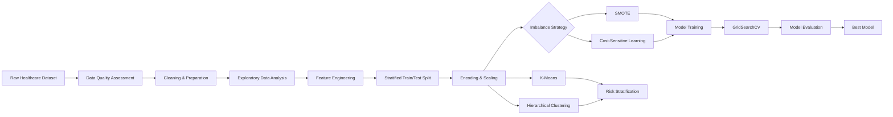

# 🧠 Stroke Risk Detection with Machine Learning

```{=html}
<p align="center">
```
`<strong>`{=html}Portfolio Data Science Project · Healthcare Analytics ·
Imbalanced Classification`</strong>`{=html}
```{=html}
</p>
```
```{=html}
<p align="center">
```
``{=html}
``{=html}
``{=html}
``{=html}
``{=html}
``{=html}
```{=html}
</p>
```

------------------------------------------------------------------------

## 📌 Project Overview

Stroke is a high-impact healthcare problem where **missing a genuine
high-risk patient can be substantially more consequential than
generating a false alarm**.

This project investigates whether machine learning can identify
meaningful stroke-risk patterns while dealing honestly with one of the
biggest challenges in healthcare classification: **severe class
imbalance**.

The dataset contains **5,110 patient records**, but only **249 stroke
cases (4.87%)**. A model that simply predicts *no stroke* for almost
everybody can appear highly accurate while being clinically unhelpful.

The central research question was therefore:

> **Which class-imbalance strategy provides more reliable stroke-risk
> prediction when the model is evaluated on a realistic, naturally
> imbalanced test set?**

Two approaches were compared:

-   **SMOTE** --- synthetic minority oversampling
-   **Cost-sensitive learning** --- assigning substantially greater
    penalty to missed stroke cases

The project also uses **unsupervised clustering** to investigate whether
patient groups with different observed stroke rates can be identified
without using the stroke outcome during clustering.

------------------------------------------------------------------------

## 🏆 Headline Results

  Finding                                                     Result
  ------------------------------- ----------------------------------
  Dataset size                                    **5,110 patients**
  Stroke prevalence                                        **4.87%**
  Best model                        **Cost-sensitive Random Forest**
  F1-score                                                **23.91%**
  Recall                                                  **82.00%**
  Precision                                               **13.99%**
  ROC-AUC                                                 **84.64%**
  Detected stroke cases                                  **41 / 50**
  Missed stroke cases                                     **9 / 50**
  High-risk cluster stroke rate                           **14.16%**
  Low-risk cluster stroke rate                             **0.17%**
  Optimal number of clusters                                   **4**
  Silhouette score                                         **0.184**

### The key result

The **cost-sensitive Random Forest outperformed the SMOTE-based Logistic
Regression approach on F1-score**:

**23.91% vs 23.16%**

More importantly, the selected model achieved **82% recall**,
identifying **41 of the 50 stroke cases in the held-out test set**.

That came at the cost of many false positives --- a deliberate trade-off
based on the project's safety-first screening objective.

------------------------------------------------------------------------

## 📊 Results at a Glance

```{=html}
<p align="center">
```
``{=html}
```{=html}
</p>
```
```{=html}
<p align="center">
```
`<em>`{=html}Comparison of precision, recall, F1-score and ROC-AUC
across baseline and optimised approaches.`</em>`{=html}
```{=html}
</p>
```
### Why accuracy was not the main metric

With approximately **95% of observations belonging to the non-stroke
class**, accuracy can be misleading.

A model predicting *no stroke* for everyone would already achieve
roughly 95% accuracy while detecting **zero stroke cases**.

For this reason, the project prioritised:

-   **Recall** --- minimise missed stroke cases
-   **F1-score** --- balance precision and recall
-   **ROC-AUC** --- assess discrimination
-   **Confusion matrix** --- understand the false-positive /
    false-negative trade-off

------------------------------------------------------------------------

# 🔬 Research Workflow



------------------------------------------------------------------------

# 🗃️ Dataset

The project uses the **Healthcare Stroke Prediction Dataset** from
Kaggle.

**5,110 records · 12 original attributes · 249 stroke cases**

### Feature groups

  Group             Variables
  ----------------- ----------------------------------------
  Demographics      Age, gender, marital status, residence
  Clinical          Average glucose level, BMI
  Medical history   Hypertension, heart disease
  Lifestyle         Work type, smoking status
  Target            `stroke`

The original target distribution is:

-   **4,861 non-stroke cases --- 95.13%**
-   **249 stroke cases --- 4.87%**

Dataset source: [Healthcare Stroke Prediction
Dataset](https://www.kaggle.com/datasets/fedesoriano/stroke-prediction-dataset)

------------------------------------------------------------------------

# 🧹 Data Quality & Cleaning

The initial quality assessment identified two major missing-data
problems:

-   `smoking_status`: **1,544 missing values (30.2%)**
-   `bmi`: **201 missing values (3.9%)**

Outlier analysis identified:

-   **627 glucose outliers (12.27%)**
-   **110 BMI outliers (2.15%)**
-   No age outliers using the IQR rule

```{=html}
<p align="center">
```
``{=html}
```{=html}
</p>
```
### Cleaning decisions

Rather than blindly deleting or imputing observations:

**Smoking status**

The 30.2% missingness was handled using an explicit `Unknown` category.
This preserves the information that smoking status was unavailable
rather than inventing a value.

**BMI**

Missing BMI values were imputed using **age × gender group medians**,
rather than a single global median.

**Outliers**

The identified glucose and BMI outliers were **retained**. In healthcare
data, extreme observations can represent genuine high-risk patients
rather than errors. Removing them could remove precisely the
observations the model is expected to detect.

```{=html}
<p align="center">
```
``{=html}
```{=html}
</p>
```
After cleaning, the dataset achieved **100% completeness** while
preserving clinically plausible extreme values.

------------------------------------------------------------------------

# 📈 Exploratory Data Analysis

The exploratory phase combined visual analysis with statistical testing.

Feature engineering introduced clinically interpretable groups:

-   Age brackets
-   WHO-style BMI categories
-   Glucose categories
-   Elderly indicator
-   Obesity indicator
-   Cardiovascular comorbidity indicator

Additional modelling features included:

-   `age_squared`
-   `hyper_heart_interaction`
-   `log_glucose`
-   `risk_score_total`

```{=html}
<p align="center">
```
``{=html}
```{=html}
</p>
```
## 🔎 Strongest observed relationships

### Age

Stroke patients had a mean age of:

**67.7 years vs 41.9 years**

Difference: **25.8 years**

Effect size:

**Cohen's d = 1.42**

This was the strongest continuous-variable relationship identified.

### Hypertension

-   Hypertension: **13.25% stroke incidence**
-   No hypertension: **3.97%**
-   Approximately **3.3× higher observed incidence**

### Heart disease

-   Heart disease: **17.03%**
-   No heart disease: **4.18%**
-   Approximately **4.1× higher observed incidence**

These are associations in the dataset, not causal estimates.

------------------------------------------------------------------------

# 🚨 High-Risk Patient Profiles

The most striking pattern appeared when multiple risk factors were
considered together.

Patients aged **60+ with cardiovascular comorbidities** represented only
**8.9% of the population**, but had an observed stroke incidence of:

## **18.46%**

Compared with:

## **3.54%**

for the remaining population.

That's approximately **5.2× the observed incidence**.

```{=html}
<p align="center">
```
``{=html}
```{=html}
</p>
```
The analysis also showed a progressive increase in stroke incidence as
the number of risk factors increased.

This finding directly influenced the feature-engineering strategy,
particularly the inclusion of interaction and cumulative-risk features.

------------------------------------------------------------------------

# 🧠 Modelling Strategy

Four algorithms were investigated:

-   Logistic Regression
-   Gaussian Naive Bayes
-   Random Forest
-   XGBoost

The modelling pipeline used:

1.  **80/20 stratified train-test split**
2.  One-hot encoding of categorical features
3.  Standardisation of numerical features
4.  Feature engineering
5.  Imbalance handling
6.  5-fold cross-validation
7.  `GridSearchCV`
8.  Model comparison using multiple evaluation metrics

### Feature engineering

The model receives both original and engineered predictors, including:

``` text
age_squared
hyper_heart_interaction
log_glucose
risk_score_total
age_group
bmi_category
glucose_category
is_elderly
is_obese
has_comorbidity
```

------------------------------------------------------------------------

# ⚖️ SMOTE vs Cost-Sensitive Learning

This was the central methodological comparison.

## SMOTE

SMOTE creates synthetic minority-class observations by interpolating
between existing stroke cases.

The training data was balanced to approximately **50/50**.

### Result

SMOTE + Logistic Regression achieved:

**23.16% F1-score**

## Cost-sensitive learning

Instead of changing the training distribution, cost-sensitive learning
keeps the original observations but penalises missed stroke cases more
heavily.

The class ratio was approximately:

**19.5 : 1**

and this imbalance was reflected in the model's weighting strategy.

### Result

Cost-sensitive Random Forest achieved:

**23.91% F1-score**

### Conclusion

In this experiment:

> **Cost-sensitive learning performed better than synthetic oversampling
> on the realistic imbalanced evaluation set.**

This supports the argument that preserving the original data
distribution while explicitly encoding the cost of false negatives can
be preferable to generating synthetic minority examples.

------------------------------------------------------------------------

# 🏅 Best Model: Cost-Sensitive Random Forest

The final selected model used:

``` text
Random Forest
300 estimators
entropy criterion
max depth = 30
class_weight = balanced_subsample
```

### Test performance

  Metric              Score
  ------------ ------------
  **Recall**     **82.00%**
  Precision          13.99%
  F1-score           23.91%
  ROC-AUC            84.64%

```{=html}
<p align="center">
```
``{=html}
```{=html}
</p>
```
### Clinical-style interpretation

On the held-out test set:

-   **41 of 50** stroke cases were detected
-   **9 of 50** stroke cases were missed
-   **252** non-stroke cases were incorrectly flagged

This is a very important trade-off.

The model does **not** have high precision. Instead, it deliberately
favours sensitivity.

For a screening-oriented system, the reasoning is:

> A false alarm may lead to additional assessment, whereas a missed
> high-risk patient may lose an opportunity for early intervention.

This is a modelling objective for the project --- **not a claim that
this model is clinically deployable**.

------------------------------------------------------------------------

# 🧩 Unsupervised Learning: Patient Risk Stratification

The project also asks a different question:

> Can patient profiles with meaningfully different stroke rates be
> discovered without giving the clustering algorithm the stroke outcome?

Two clustering approaches were used:

-   **K-Means**
-   **Agglomerative / Hierarchical Clustering**

Silhouette analysis selected:

### **4 clusters**

with a silhouette score of:

### **0.184**

The clusters showed meaningful differences in observed stroke incidence.

  Group                              Patients   Observed stroke rate
  -------------------------------- ---------- ----------------------
  High-risk K-Means cluster               565             **14.16%**
  Low-risk K-Means cluster                579              **0.17%**
  Hierarchical high-risk cluster          ---             **14.01%**

The high-risk cluster's stroke rate was nearly **3× the overall dataset
prevalence**.

------------------------------------------------------------------------

# 🗺️ t-SNE Cluster Visualisation

To visualise the high-dimensional feature space, **27 features** were
projected into two dimensions using t-SNE.

```{=html}
<p align="center">
```
``{=html}
```{=html}
</p>
```
The visualisation shows that high-risk patient clusters occupy
distinguishable regions of the projected feature space, with observed
stroke cases concentrating more heavily in these areas.

The clustering results therefore provide an independent perspective that
complements the supervised classification results.

------------------------------------------------------------------------

# 📊 Key Findings

### 01 --- Class imbalance matters

The dataset contains only **4.87% stroke cases**.

Accuracy alone would therefore give an incomplete and potentially
misleading view of model quality.

### 02 --- Age was the strongest observed predictor

Stroke patients were, on average, **25.8 years older** than non-stroke
patients.

The effect size was substantial:

**Cohen's d = 1.42**

### 03 --- Comorbidities substantially increased observed risk

Hypertension and heart disease were associated with approximately:

-   **3.3×** higher stroke incidence for hypertension
-   **4.1×** higher stroke incidence for heart disease

### 04 --- Risk factors interact

Patients aged 60+ with cardiovascular comorbidities had an observed
stroke incidence of **18.46%**, compared with **3.54%** for the
remaining population.

### 05 --- Cost-sensitive learning won the central comparison

Cost-sensitive Random Forest:

**23.91% F1**

SMOTE + Logistic Regression:

**23.16% F1**

### 06 --- Recall was prioritised over precision

The final model achieved:

**82% recall**

and detected **41 of 50** stroke cases in the test set.

### 07 --- Clustering found meaningful patient groups

Unsupervised methods identified clusters with observed stroke rates
ranging from approximately:

**0.17% → 14.16%**

------------------------------------------------------------------------

# 🛠️ Tech Stack

  -----------------------------------------------------------------------
  Area                                Tools
  ----------------------------------- -----------------------------------
  Language                            Python

  Data manipulation                   Pandas, NumPy

  Visualisation                       Matplotlib, Seaborn

  Statistics                          SciPy

  Machine learning                    Scikit-learn

  Gradient boosting                   XGBoost

  Imbalance handling                  imbalanced-learn / SMOTE

  Classification                      Logistic Regression, Naive Bayes,
                                      Random Forest, XGBoost

  Optimisation                        GridSearchCV, 5-fold CV

  Clustering                          K-Means, Agglomerative Clustering

  Dimensionality reduction            t-SNE
  -----------------------------------------------------------------------

------------------------------------------------------------------------

# 📁 Repository Structure

``` text
StrokeRiskDetection/
│
├── data/
│   └── healthcare-dataset-stroke-data.csv
│
├── stroke_data_cleaned.csv
│
├── data_quality_assesment.py
├── data_cleaning_preparation.py
├── data_exploration.py
├── data_modelling_visualisation.py
│
├── README.md
├── .gitignore
│
├── assets/
│   ├── 01_missing_values.png
│   ├── 02_data_cleaning_impact.png
│   ├── 03_exploratory_analysis.png
│   ├── 04_risk_associations.png
│   ├── 05_high_risk_profiles.png
│   ├── 06_model_performance.png
│   ├── 07_roc_curves.png
│   └── 08_clustering_tsne.png
│
└── docs/
    └── Stroke_Detection_Report.pdf
```

------------------------------------------------------------------------

# 🚀 Running the Project

## 1. Clone the repository

``` bash
git clone https://github.com/Beastly12/StrokeRiskDetection.git
cd StrokeRiskDetection
```

## 2. Create a virtual environment

### macOS / Linux

``` bash
python3 -m venv .venv
source .venv/bin/activate
```

### Windows

``` bash
python -m venv .venv
.venv\Scripts\activate
```

## 3. Install dependencies

``` bash
pip install pandas numpy matplotlib seaborn scipy scikit-learn xgboost imbalanced-learn
```

## 4. Run the analysis

Run the scripts in this order:

``` bash
python data_quality_assesment.py
python data_cleaning_preparation.py
python data_exploration.py
python data_modelling_visualisation.py
```

> **Note:** The current scripts are designed to be run from the project
> root because they use relative file paths.

------------------------------------------------------------------------

# 📚 Full Research Report

A detailed academic report containing the methodology, statistical
analysis, results, limitations and references is included here:

**[`readmepackage/doc/Stroke_Detection_Report.pdf`](readmepackage/doc/Stroke_Detection_Report.pdf)**

------------------------------------------------------------------------

# ⚠️ Limitations & Responsible Use

This repository is a **data science research and portfolio project**,
not a medical diagnostic system.

Important limitations include:

-   Only **249 stroke cases** are available in the dataset.
-   The dataset is observational and relatively small for healthcare
    modelling.
-   The class imbalance makes minority-class evaluation difficult.
-   SMOTE creates synthetic observations rather than genuinely new
    patient data.
-   The results may not generalise to other populations or healthcare
    systems.
-   Observed associations should not be interpreted as causal
    relationships.
-   The `Unknown` smoking-status category may introduce confounding.
-   Extreme values were intentionally retained because they may
    represent genuine high-risk patients.
-   The model has relatively low precision and therefore produces many
    false positives.
-   There is no external validation cohort.
-   The model has not undergone clinical validation or regulatory
    assessment.

**Do not use this project to diagnose, triage, or make treatment
decisions for real patients.**

------------------------------------------------------------------------

# 🔮 Future Work

Potential improvements include:

-   [ ] Add a reproducible `requirements.txt`
-   [ ] Refactor preprocessing into reusable sklearn `Pipeline` objects
-   [ ] Add automated tests for data-cleaning functions
-   [ ] Add external validation data
-   [ ] Perform nested cross-validation
-   [ ] Evaluate calibration and probability reliability
-   [ ] Compare ADASYN, Tomek Links and hybrid sampling methods
-   [ ] Investigate robust scaling for extreme values
-   [ ] Add SHAP-based model explainability
-   [ ] Add threshold optimisation using a validation set
-   [ ] Build an interactive Streamlit demonstration
-   [ ] Add Docker support
-   [ ] Add GitHub Actions for automated testing
-   [ ] Track experiments and model versions

------------------------------------------------------------------------

# 🧠 What This Project Demonstrates

This project demonstrates an end-to-end approach to a difficult
real-world machine-learning problem:

**Data quality → statistical reasoning → feature engineering → imbalance
handling → model optimisation → realistic evaluation → unsupervised
validation**

More importantly, it demonstrates a key lesson in applied machine
learning:

> **A model with an impressive metric is not necessarily a better model
> if the evaluation setup does not reflect the real problem.**

For this project, realistic class prevalence and the cost of missed
cases were treated as first-class modelling considerations.

------------------------------------------------------------------------

## 📖 References

-   Chawla, N.V., Bowyer, K.W., Hall, L.O. & Kegelmeyer, W.P. (2002).
    *SMOTE: Synthetic Minority Over-sampling Technique*. Journal of
    Artificial Intelligence Research, 16, 321--357.
-   Feigin, V.L. et al. (2022). *Global, regional, and national burden
    of stroke and its risk factors, 1990--2019*. The Lancet Neurology.
-   Melnykova, N. et al. (2025). *Machine learning for stroke prediction
    using imbalanced data*. Scientific Reports, 15, 33773.
-   Gupta, A. et al. (2025). *Predicting stroke risk: an effective
    stroke prediction model based on neural networks*. Journal of
    Neurorestoratology, 13(1), 100156.
-   American Diabetes Association (2021). *Standards of Medical Care in
    Diabetes*.
-   World Health Organization (2023). *Stroke / Cerebrovascular
    accident*.
-   American Heart Association (2023). *Stroke Risk Factors*.

------------------------------------------------------------------------

## 👤 Author

**Dafe Edesiri Otudje**

Data Science Portfolio Project ·

------------------------------------------------------------------------

```{=html}
<p align="center">
```
`<sub>`{=html}Built with Python · Machine Learning · Statistical
Analysis · Healthcare Data Science`</sub>`{=html}
```{=html}
</p>
```
