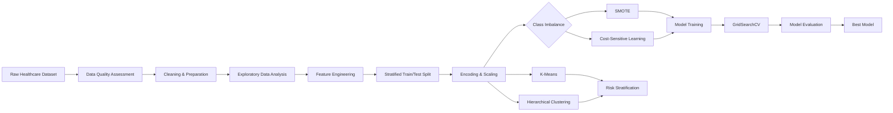

# 🧠 Stroke Risk Detection with Machine Learning

<p align="center">
  <strong>Healthcare Analytics · Imbalanced Classification · Supervised & Unsupervised Learning</strong>
</p>

<p align="center">
  
  
  
  
  
  
</p>

---

## 📌 Overview

Stroke prediction is a challenging machine-learning problem because genuine stroke cases are rare compared with non-stroke cases.

This project investigates whether machine learning can identify meaningful stroke-risk patterns while handling severe class imbalance responsibly.

The dataset contains **5,110 patient records**, including only **249 stroke cases (4.87%)**. A classifier that predicts "no stroke" for nearly everyone could appear highly accurate while failing to identify the patients who matter most.

The central research question was:

> **Which class-imbalance strategy provides more reliable stroke-risk prediction when evaluated on a realistic, naturally imbalanced test set?**

The project compares:

- **SMOTE** — synthetic minority oversampling
- **Cost-sensitive learning** — increasing the penalty for missed stroke cases

It also uses **K-Means and hierarchical clustering** to investigate whether patient subgroups with substantially different observed stroke rates can be identified without using the stroke outcome as a clustering input.

> ⚠️ **This is an educational and portfolio project, not a medical diagnostic system. It must not be used for clinical decision-making.**

---

## 🏆 Key Results

| Metric / Finding | Result |
|---|---:|
| Dataset size | **5,110 patients** |
| Stroke prevalence | **4.87%** |
| Best model | **Cost-sensitive Random Forest** |
| F1-score | **23.91%** |
| Recall | **82.00%** |
| Precision | **13.99%** |
| ROC-AUC | **84.64%** |
| Stroke cases detected | **41 / 50** |
| Stroke cases missed | **9 / 50** |
| High-risk cluster stroke rate | **14.16%** |
| Low-risk cluster stroke rate | **0.17%** |
| Optimal number of clusters | **4** |
| Silhouette score | **0.184** |

### Why these numbers matter

The best model achieved **82% recall**, detecting **41 of the 50 stroke cases** in the held-out test set.

This was deliberately achieved at the expense of precision: the model produced **252 false positives**. For this research project, that trade-off was considered preferable to missing a larger proportion of positive cases.

The cost-sensitive Random Forest also slightly outperformed the SMOTE + Logistic Regression approach:

**23.91% F1 vs 23.16% F1**

---

## 📊 Model Performance

<p align="center">
  
</p>

The project does **not** treat accuracy as the primary metric.

With roughly 95% of observations belonging to the non-stroke class, a model could obtain high accuracy simply by predicting the majority class.

Instead, the analysis focuses on:

- **Recall** — how many actual stroke cases are detected
- **Precision** — how many predicted stroke cases are genuinely positive
- **F1-score** — balance between precision and recall
- **ROC-AUC** — discrimination between classes
- **Confusion matrix** — false-positive and false-negative behaviour

---

# 🔬 Research Workflow



---

# 🗃️ Dataset

The project uses the **Healthcare Stroke Prediction Dataset** from Kaggle.

**5,110 records · 12 original attributes · 249 stroke cases**

### Main variables

| Category | Variables |
|---|---|
| Demographics | Age, gender, marital status, residence |
| Clinical | Average glucose level, BMI |
| Medical history | Hypertension, heart disease |
| Lifestyle | Work type, smoking status |
| Target | `stroke` |

### Class distribution

- **4,861 non-stroke cases — 95.13%**
- **249 stroke cases — 4.87%**

Dataset: [Healthcare Stroke Prediction Dataset](https://www.kaggle.com/datasets/fedesoriano/stroke-prediction-dataset)

---

# 🧹 Data Quality & Cleaning

The initial quality assessment identified two major missing-data issues:

- `smoking_status`: **1,544 missing values (30.2%)**
- `bmi`: **201 missing values (3.9%)**

IQR analysis identified:

- **627 glucose outliers (12.27%)**
- **110 BMI outliers (2.15%)**
- No age outliers

<p align="center">
  
</p>

## Cleaning decisions

### Smoking status

Because 30.2% of smoking-status values were missing, the missing observations were assigned an explicit:

`Unknown`

category.

This preserves missingness rather than inventing a smoking history.

### BMI

Missing BMI values were imputed using **age × gender group medians**, rather than one global median.

### Outliers

Identified glucose and BMI outliers were **retained**.

In healthcare data, extreme observations can represent genuine high-risk patients rather than erroneous measurements. Removing these cases could remove exactly the observations the model is supposed to detect.

<p align="center">
  
</p>

After preprocessing, the dataset achieved **100% completeness** while preserving clinically plausible extreme values.

---

# 📈 Exploratory Data Analysis

The exploratory analysis combined visualisation, statistical testing and domain-informed feature engineering.

The analysis created:

- Age brackets
- BMI categories
- Glucose categories
- Elderly indicator
- Obesity indicator
- Cardiovascular comorbidity indicator

Additional modelling features included:

- `age_squared`
- `hyper_heart_interaction`
- `log_glucose`
- `risk_score_total`

<p align="center">
  
</p>

## 🔎 Strongest observed relationships

### Age

Stroke patients had a mean age of:

**67.7 years vs 41.9 years**

Difference:

**25.8 years**

Effect size:

**Cohen's d = 1.42**

Age was the strongest continuous-variable relationship identified.

### Hypertension

- Hypertension: **13.25% stroke incidence**
- No hypertension: **3.97%**
- Approximately **3.3× higher observed incidence**

### Heart disease

- Heart disease: **17.03%**
- No heart disease: **4.18%**
- Approximately **4.1× higher observed incidence**

These are associations in the dataset and should not be interpreted as causal effects.

---

# 🚨 High-Risk Patient Profiles

The strongest pattern emerged when multiple risk factors were considered together.

Patients aged **60+ with cardiovascular comorbidities** represented only **8.9% of the population**, but had an observed stroke incidence of:

## **18.46%**

Compared with:

## **3.54%**

for the remaining population.

That corresponds to approximately **5.2× the observed incidence**.

<p align="center">
  
</p>

The analysis also showed progressive increases in stroke incidence as the number of risk factors increased.

These findings informed the feature-engineering strategy, particularly the inclusion of interaction and cumulative-risk features.

---

# 🧠 Machine Learning Approach

Four algorithms were evaluated:

- Logistic Regression
- Gaussian Naive Bayes
- Random Forest
- XGBoost

The modelling workflow used:

1. **80/20 stratified train-test split**
2. One-hot encoding
3. Numerical feature standardisation
4. Feature engineering
5. Class-imbalance handling
6. 5-fold cross-validation
7. `GridSearchCV`
8. Multi-metric model evaluation

### Engineered features

```text
age_squared
hyper_heart_interaction
log_glucose
risk_score_total
age_group
bmi_category
glucose_category
is_elderly
is_obese
has_comorbidity
```

---

# ⚖️ SMOTE vs Cost-Sensitive Learning

This was the central methodological comparison.

## SMOTE

SMOTE creates synthetic minority-class observations by interpolating between existing stroke cases.

The training set was balanced to approximately **50/50**.

### Result

**SMOTE + Logistic Regression**

**23.16% F1-score**

## Cost-sensitive learning

Cost-sensitive learning keeps the original observations but increases the penalty associated with misclassifying stroke cases.

The approximate class ratio was:

**19.5 : 1**

### Result

**Cost-sensitive Random Forest**

**23.91% F1-score**

### Outcome

The cost-sensitive approach slightly outperformed SMOTE in this experiment.

This supports the project's finding that maintaining the original data while explicitly encoding the consequences of false negatives can be preferable to synthetic oversampling when evaluating against a realistic, imbalanced test distribution.

---

# 🏅 Best Model: Cost-Sensitive Random Forest

The selected model used:

```text
Random Forest
300 estimators
entropy criterion
max depth = 30
class_weight = balanced_subsample
```

### Test performance

| Metric | Score |
|---|---:|
| **Recall** | **82.00%** |
| Precision | 13.99% |
| F1-score | 23.91% |
| ROC-AUC | 84.64% |

<p align="center">
  
</p>

### Confusion-matrix interpretation

On the held-out test set:

- **41 / 50** stroke cases detected
- **9 / 50** stroke cases missed
- **252** non-stroke cases incorrectly flagged

The model therefore prioritises **sensitivity over precision**.

That is an intentional modelling choice for this project, not a claim that the model is suitable for clinical deployment.

---

# 🧩 Unsupervised Learning & Risk Stratification

The project also investigates a different question:

> **Can patient profiles with meaningfully different stroke rates be discovered without using the stroke outcome during clustering?**

Two approaches were evaluated:

- **K-Means**
- **Agglomerative / Hierarchical Clustering**

Silhouette analysis selected:

### **4 clusters**

with a silhouette score of:

### **0.184**

| Cluster | Patients | Observed stroke rate |
|---|---:|---:|
| High-risk K-Means cluster | 565 | **14.16%** |
| Low-risk K-Means cluster | 579 | **0.17%** |
| High-risk hierarchical cluster | — | **14.01%** |

The high-risk cluster had an observed stroke rate nearly three times the overall dataset prevalence.

---

# 🗺️ t-SNE Visualisation

To visualise high-dimensional patient profiles, **27 features** were projected into two dimensions using t-SNE.

<p align="center">
  
</p>

The resulting visualisation shows meaningful separation between patient groups, with observed stroke cases concentrating more strongly in high-risk regions.

This provides an independent perspective that complements the supervised classification results.

---

# 📊 Key Findings

### 01 — Class imbalance changes the evaluation problem

Only **4.87%** of observations represent stroke cases.

Accuracy therefore provides an incomplete picture of model usefulness.

### 02 — Age was the strongest observed predictor

Stroke patients were **25.8 years older on average** than non-stroke patients.

**Cohen's d = 1.42**

### 03 — Medical history mattered

Observed stroke incidence was approximately:

- **3.3× higher** among patients with hypertension
- **4.1× higher** among patients with heart disease

### 04 — Risk factors interacted

Patients aged 60+ with cardiovascular comorbidities had an observed stroke incidence of **18.46%**, compared with **3.54%** for the remaining population.

### 05 — Cost-sensitive learning performed best

Cost-sensitive Random Forest:

**23.91% F1**

SMOTE + Logistic Regression:

**23.16% F1**

### 06 — Recall was deliberately prioritised

The final model achieved:

**82% recall**

and detected **41 of 50** stroke cases.

### 07 — Clustering revealed distinct risk groups

Unsupervised methods identified groups ranging from approximately:

**0.17% → 14.16% observed stroke incidence**

---

# 🛠️ Tech Stack

| Area | Tools |
|---|---|
| Language | Python |
| Data manipulation | Pandas, NumPy |
| Visualisation | Matplotlib, Seaborn |
| Statistics | SciPy |
| Machine learning | Scikit-learn |
| Gradient boosting | XGBoost |
| Imbalance handling | imbalanced-learn / SMOTE |
| Classification | Logistic Regression, Naive Bayes, Random Forest, XGBoost |
| Optimisation | GridSearchCV, 5-fold CV |
| Clustering | K-Means, Agglomerative Clustering |
| Dimensionality reduction | t-SNE |

---

# 📁 Repository Structure

```text
StrokeRiskDetection/
│
├── data/
│   └── healthcare-dataset-stroke-data.csv
│
├── assets/
│   ├── 01_missing_values.png
│   ├── 02_data_cleaning_impact.png
│   ├── 03_exploratory_analysis.png
│   ├── 05_high_risk_profiles.png
│   ├── 06_model_performance.png
│   ├── 07_roc_curves.png
│   └── 08_clustering_tsne.png
│
├── docs/
│   └── Stroke_Detection_Report.pdf
│
├── stroke_data_cleaned.csv
├── data_quality_assesment.py
├── data_cleaning_preparation.py
├── data_exploration.py
├── data_modelling_visualisation.py
├── README.md
└── .gitignore
```

---

# 🚀 Getting Started

## 1. Clone the repository

```bash
git clone https://github.com/Beastly12/StrokeRiskDetection/tree/main
cd StrokeRiskDetection
```

## 2. Create a virtual environment

### macOS / Linux

```bash
python3 -m venv .venv
source .venv/bin/activate
```

### Windows

```bash
python -m venv .venv
.venv\Scriptsctivate
```

## 3. Install dependencies

```bash
pip install pandas numpy matplotlib seaborn scipy scikit-learn xgboost imbalanced-learn
```

## 4. Run the analysis

Run the scripts in this order:

```bash
python data_quality_assesment.py
python data_cleaning_preparation.py
python data_exploration.py
python data_modelling_visualisation.py
```

> **Note:** The current scripts use relative paths, so run them from the repository root.

---

# 📄 Full Report

The complete academic report is available in:

**[`docs/Stroke_Detection_Report.pdf`](docs/Stroke_Detection_Report.pdf)**

It contains the full methodology, statistical analysis, model evaluation, clustering analysis, limitations and references.

---

# ⚠️ Limitations & Responsible Use

This repository is a **data science research and portfolio project**, not a medical diagnostic system.

Important limitations include:

- Only **249 stroke cases** are available.
- The dataset is observational and relatively small for healthcare modelling.
- Severe class imbalance makes minority-class evaluation difficult.
- SMOTE generates synthetic observations rather than genuinely new patient data.
- Results may not generalise to other populations.
- Observed associations should not be interpreted as causal relationships.
- Missing smoking-status values were retained as `Unknown`, which may introduce confounding.
- Extreme glucose and BMI values were intentionally retained.
- The final model has low precision and produces many false positives.
- No external validation cohort is included.
- The model has not undergone clinical validation or regulatory assessment.

**Do not use this project to diagnose, triage, or make treatment decisions for real patients.**

---

# 🔮 Future Work

- [ ] Add a reproducible `requirements.txt`
- [ ] Refactor preprocessing into reusable sklearn `Pipeline` objects
- [ ] Add automated tests
- [ ] Add external validation data
- [ ] Perform nested cross-validation
- [ ] Evaluate probability calibration
- [ ] Compare ADASYN, Tomek Links and hybrid sampling
- [ ] Investigate robust scaling for extreme values
- [ ] Add SHAP-based explainability
- [ ] Optimise classification thresholds using validation data
- [ ] Build an interactive Streamlit demonstration
- [ ] Add Docker support
- [ ] Add GitHub Actions for automated testing
- [ ] Track experiments and model versions

---

# 🧠 What I Learned

This project reinforced that applied machine learning is not simply about finding the model with the highest headline score.

The key lessons were:

- **Data quality decisions affect model behaviour.**
- **Accuracy can be misleading under severe class imbalance.**
- **Evaluation methodology matters as much as algorithm choice.**
- **False negatives and false positives can have very different consequences.**
- **Synthetic balancing is not automatically better than cost-sensitive learning.**
- **Unsupervised learning can provide a useful second perspective on supervised results.**
- **Healthcare machine learning requires transparency about uncertainty, limitations and responsible use.**

The most important conclusion was:

> **Realistic evaluation is more valuable than an impressive metric obtained under unrealistic conditions.**

---

## 👤 Author

**Dafe Edesiri Otudje**

Data Science Portfolio · 

---

<p align="center">
  <sub>Built with Python · Machine Learning · Statistical Analysis · Healthcare Data Science</sub>
</p>
